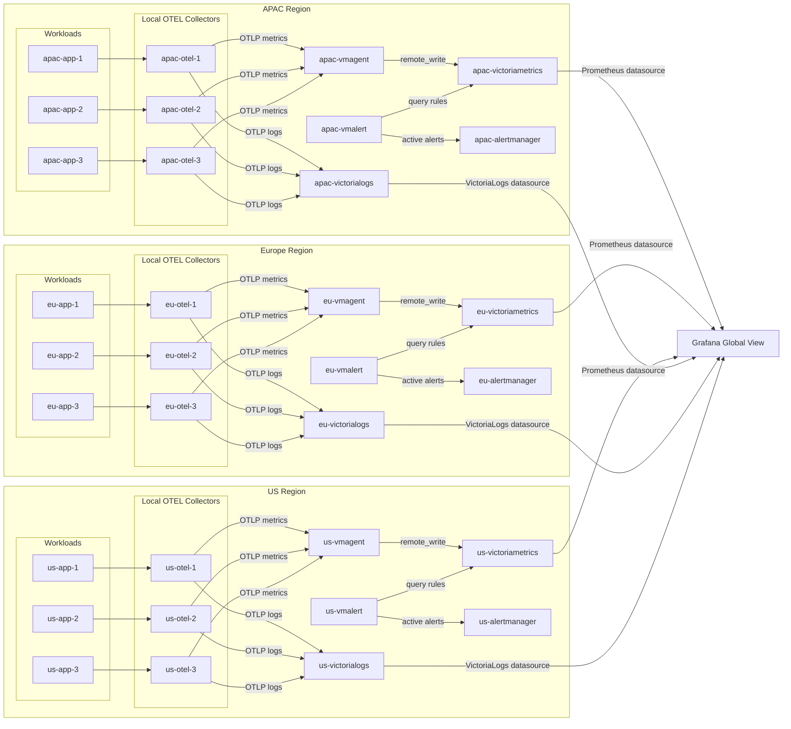

# Metrics Playground

A local, Docker Compose-based lab for evaluating event-based alerting with OpenTelemetry, VictoriaMetrics, VictoriaLogs, vmalert, Alertmanager, and Grafana.

## Overview

This lab models a three-region (APAC, EU, US) observability stack with **34 services**. Each region has 3 workloads, 3 local OTEL collectors, a vmagent, VictoriaMetrics, VictoriaLogs, vmalert, and Alertmanager. A single Grafana instance provides the global view.

One event produces two signals:

- A **metric** (`lab_alert_active` gauge) that drives the alerting decision
- A **log record** that carries rich context for investigation

## Architecture



## Quick Start

```bash
docker compose up -d
```

## Raise an Alert

```bash
curl -X POST http://localhost:8081/raise \
  -H 'Content-Type: application/json' \
  -d '{
    "alert_name": "HighLatency",
    "severity": "critical",
    "reason": "p99 latency exceeded 500ms"
  }'
```

## Clear an Alert

```bash
curl -X POST http://localhost:8081/clear \
  -H 'Content-Type: application/json' \
  -d '{"alert_id": "<alert_id>"}'
```

## Exposed Ports

| Port | Service |
|---|---|
| 3000 | Grafana (admin/admin) |
| 8081–8083 | APAC workloads |
| 8084–8086 | EU workloads |
| 8087–8089 | US workloads |
| 9093 | APAC Alertmanager |
| 9094 | EU Alertmanager |
| 9095 | US Alertmanager |

## Documentation

Full documentation is available via [MkDocs](https://www.mkdocs.org/):

```bash
pip install mkdocs
mkdocs serve
```

Then open [http://localhost:8000](http://localhost:8000).

## Tear Down

```bash
docker compose down        # stop containers
docker compose down -v     # stop and remove volumes
```
