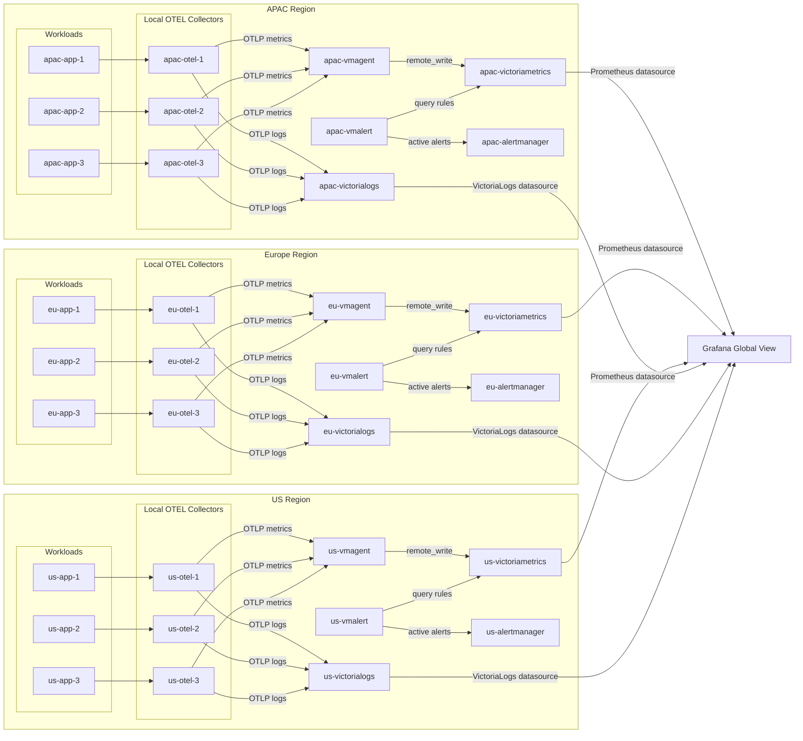

# Architecture

## Overview

The lab models a three-region observability and alerting stack. Each region contains a self-contained slice:

| Per Region | Count |
|---|---|
| Workload containers | 3 |
| Local OpenTelemetry Collectors | 3 |
| vmagent | 1 |
| VictoriaMetrics | 1 |
| VictoriaLogs | 1 |
| vmalert | 1 |
| Alertmanager | 1 |

A single Grafana instance connects to all regional backends. **34 services total**.

## Diagram

## Signal Flow

| Source | Signal | Destination | Purpose |
|---|---|---|---|
| Workload | OTLP metrics | Local collector | Emit alert-driving metric |
| Workload | OTLP logs | Local collector | Emit rich context log |
| Local collector | Metrics | Regional vmagent | Regional metric ingress |
| Local collector | Logs | Regional VictoriaLogs | Regional log ingestion |
| vmagent | Prometheus remote_write | Regional VictoriaMetrics | Metrics persistence |
| vmalert | Query API | Regional VictoriaMetrics | Rule evaluation |
| vmalert | Alert notifications | Regional Alertmanager | Alert lifecycle management |
| Grafana | Datasource query | Regional VictoriaMetrics | Dashboards |
| Grafana | Datasource query | Regional VictoriaLogs | Logs and correlations |

## Event Model

A single logical event becomes two telemetry records:

### Metric Signal

- **Name**: `lab_alert_active`
- **Type**: Gauge
- **Values**: `1` (active/firing), `0` (cleared)
- **Labels**: `region`, `service`, `component`, `instance`, `alert_name`, `severity`, `alert_id`, `source`

### Log Signal

Rich context attributes including `alert_id`, `alert_name`, `state`, `region`, `service`, `component`, `severity`, `reason`, `message`, `correlation_id`, and `event_time`.

The `alert_id` field enables correlation between the metric and log signals in Grafana.

## Networking

All services share a single Docker bridge network (`lab-net`). Internal service-to-service traffic is not exposed to the host.

## Persistence

Named Docker volumes are provisioned for every stateful component (28 volumes total), ensuring state survives container restarts for meaningful failure testing.
